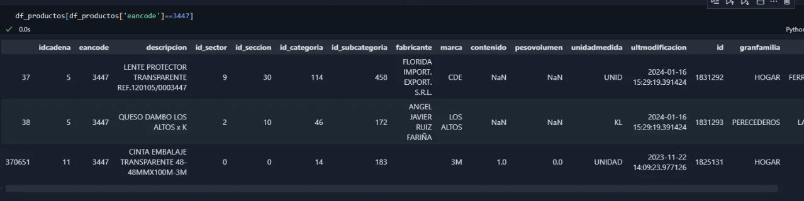

# Informe de Análisis de Datos

## 1. Problemas de Relación entre Tablas

Durante el análisis de los datos, se identificaron varios problemas en la relación entre la tabla de productos y la tabla de tickets:

### a) Uso de `eancode` e `idcadena` para Relacionar Tablas
Los campos `eancode` e `idcadena` se podrían utilizar para relacionar los productos con los tickets, sin embargo, se encontraron inconsistencias en los datos.

### b) Descripciones Diferentes para el Mismo `eancode` e `idcadena`
Se detectaron filas en las que `eancode` e `idcadena` son los mismos, pero la descripción del producto varía. Esto podría deberse a cambios en la nomenclatura o a errores de digitación.

*Ejemplo visual del problema:*  

### c) Diferencias por Caracteres Especiales o Acentos
Otro problema detectado es la existencia de productos con el mismo `eancode` e `idcadena`, pero con diferencias en la descripción debidas a acentos o caracteres especiales. Esto dificulta la agrupación y consolidación de los datos.

### d) Categorías de Uso Interno
Se identificaron productos con la categoría "Uso Interno" que aparecían duplicados en la base de datos. Para este análisis, se decidió excluir estos productos de la relación con los tickets para evitar inconsistencias.

## 2. Problemas en la Codificación de los Datos

Se encontraron problemas de codificación en los archivos TXT descargados directamente, lo que afecta la integración de los datos:

### a) Caracteres Especiales Mal Codificados
Los caracteres especiales como `Ñ` o letras con acento (`á, é, í, ó, ú`) no fueron correctamente codificados en los archivos de productos, lo que generó dificultades al intentar unir tablas utilizando la descripción como clave.

Por otro lado, en la tabla de tickets, los mismos caracteres sí aparecen correctamente codificados, lo que agrava la incompatibilidad.

*Ejemplo visual del problema:*  

## 3. Problemas en la Extracción de Datos

Durante la extracción de los archivos TXT, se encontraron problemas estructurales que complicaron el procesamiento de los datos:

### a) Caracteres de Salto de Línea `_x000d_`
Algunos registros contienen caracteres como `_x000d_`, que representan saltos de línea no deseados. Esto genera problemas al leer los archivos y puede ocasionar filas incompletas o mal formateadas.

### b) Uso Incorrecto de Separadores
En el archivo de productos, se detectaron inconsistencias en los delimitadores. En algunas filas se usa `;` en lugar de `:` para separar campos, lo que genera errores en la estructura de los datos.

*Ejemplo visual del problema:*  

## 4. Inconsistencias entre `eancode` y Descripciones

El último problema identificado es la existencia de productos con descripciones que pueden asociarse a la tabla de tickets, pero donde el `eancode` no coincide. Esto sugiere posibles errores en la asignación de códigos o la existencia de productos duplicados con diferentes identificadores.

*Ejemplo visual del problema:*  

---

Estos hallazgos resaltan la importancia de realizar una limpieza y normalización de los datos antes de utilizarlos en cualquier análisis o modelo predictivo. Como siguiente paso, se deben definir estrategias de tratamiento para cada uno de estos problemas.

